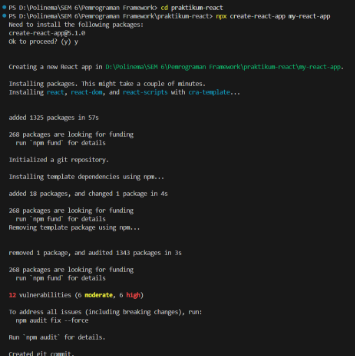
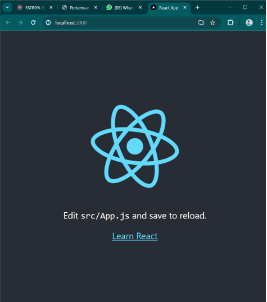
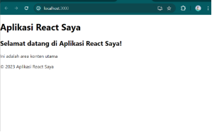
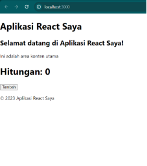
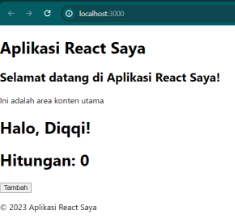
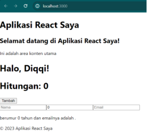
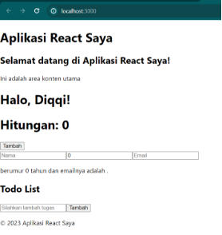

# Praktikum React
Nama  : Fatriya Ibnu Ash shidiqqi  
Kelas : TI 3C  
NIM   : 2241720138

1. Persiapan Praktikum

   

   

1. Membuat Komponen React

   

1. Menggunakan jsx untuk membuat komponen dinamis

   

1. Menggunakan props untuk mengirim data

   

1. Menggunakan state untuk mengelola data

   

Tugas Praktikum

1. Buat komponen baru bernama TodoList yang menampilkan daftar tugas (todo list). Gunakan state untuk mengelola daftar tugas dan props untuk mengirim data tugas ke komponen anak.
1. Tambahkan fitur untuk menambahkan tugas baru ke dalam daftar menggunakan form input.
1. Implementasikan fitur untuk menghapus tugas dari daftar.

